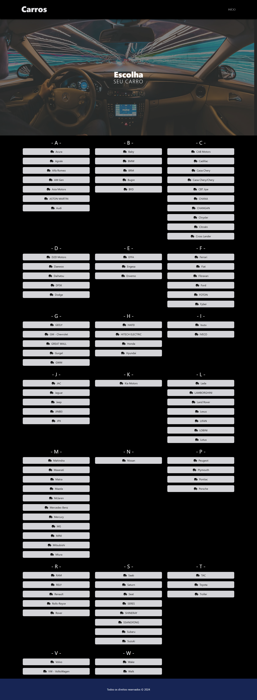
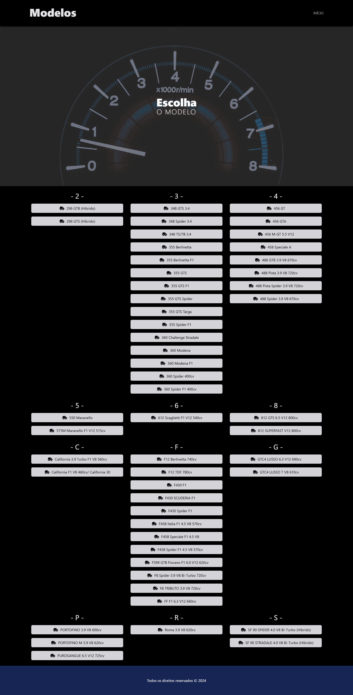
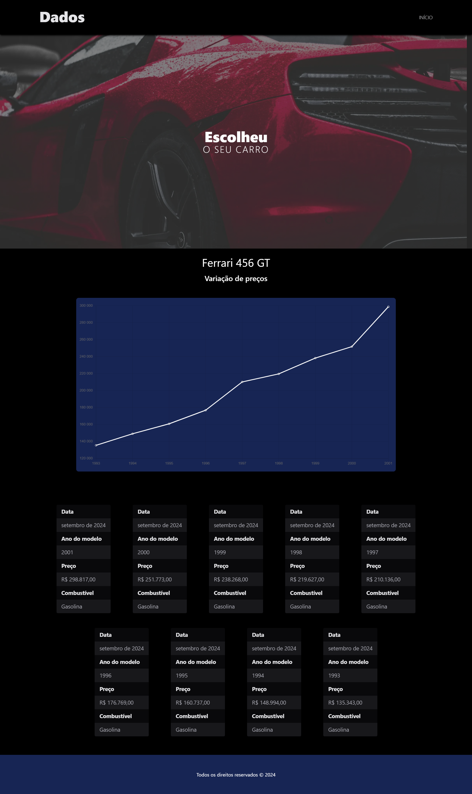

# Carros App

## ⚙️ Tecnologias utilizadas ⚙️
- Aplicação fullstack com Turbo Repo para executar o frontend e o backend simultaneamente
- TypeScript para Frontend e Backend

## 💎 Frontend 💎
- Frontend desenvolvido com Next.JS
- Tabler Icons para ícones do Frontend
- TailwindCSS para estilização
- ChartJS para construção dos gráficos no Frontend

## 🧑‍💻 Backend 🧑‍💻
- Backend desenvolvido com Express para criação das rotas

## 📐 Regras seguidas para o projeto 📐
- A Aplicação foi divida entre Frontend e Backend
- O frontend consumiu as rotas do Backend próprio

## ⚙️ Ferramentas necessárias e recomendadas para executar o projeto ⚙️
- Node v20.17.0
- NPM v10.8.3
- Yarn v1.22.22

## 🧐 Como executar esse projeto? 🧐
Faça o clone da aplicação com:
```
  git clone https://github.com/AlexandreConte/carsApp.git
```

Acesse a pasta raiz do repositório:
```
  cd carsApp
```

Abra o terminal na pasta carsApp e instale as dependências das aplicações:
```
  yarn
```

Faça o build do frontend, na pasta raiz do projeto:
```
  yarn build
```

Agora basta executar o comando para iniciar a aplicação:
```
  yarn run dev
```

Acesse em seu navegador o endereço
<a href="http://localhost:3000/">
  http://localhost:3000/
</a>

## Telas da aplicação

### Tela inicial


Ao clicar em uma das opções de carro ocorre o acesso para a próxima página:
### Tela de Modelos dos carros


Ao clicar em um modelo, a aplicação acessa os dados do modelo:
### Tela de informações sobre o modelo escolhido
Consta com as seguintes informaçõesm sobre o modelo escolhido:
- Ano do modelo
- Preço
- Tipo de combustível utilizado no modelo

Os dados são processados e utilizados no gráfico que mostra a variação de preço do modelo ao longo dos anos.

