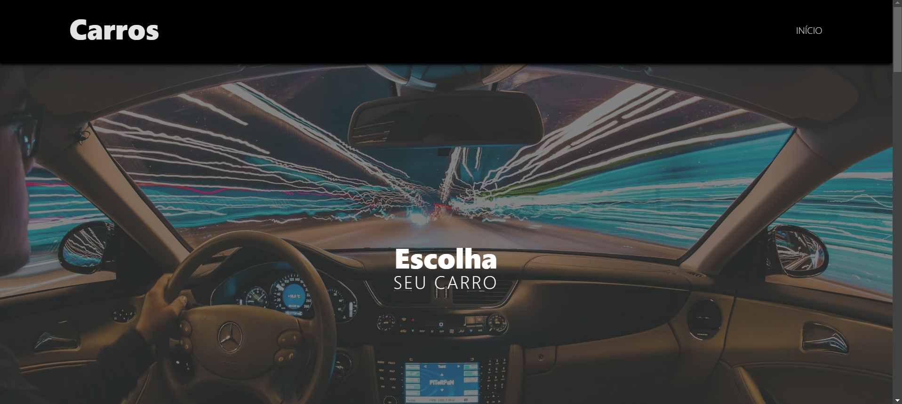
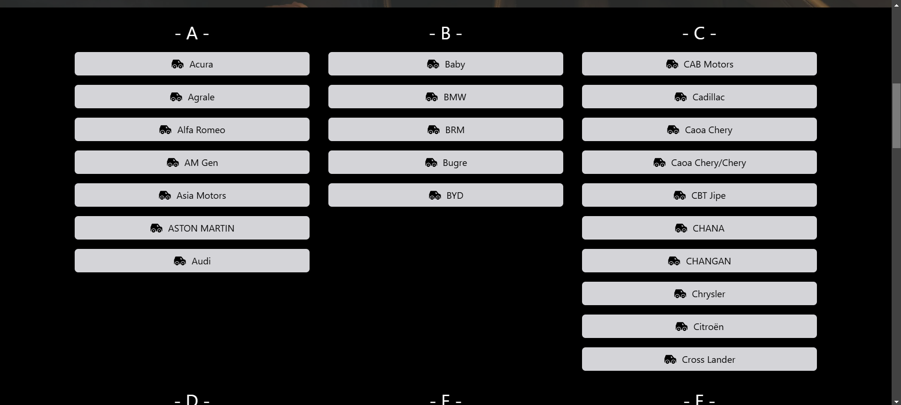
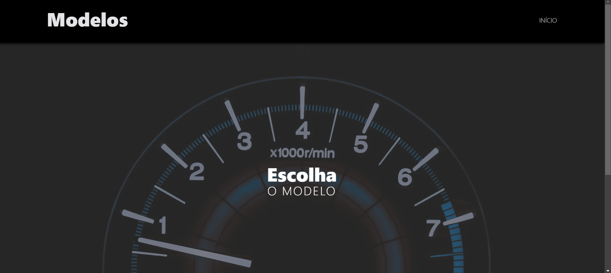
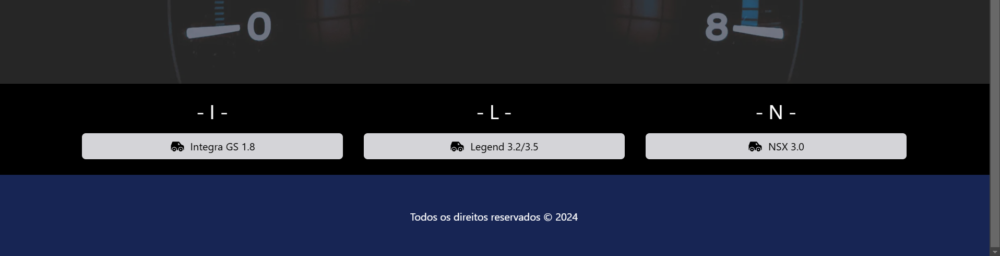
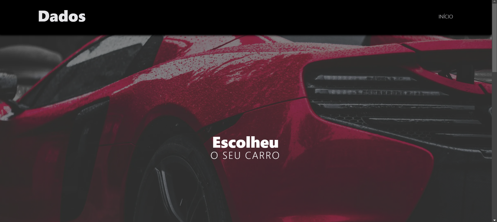
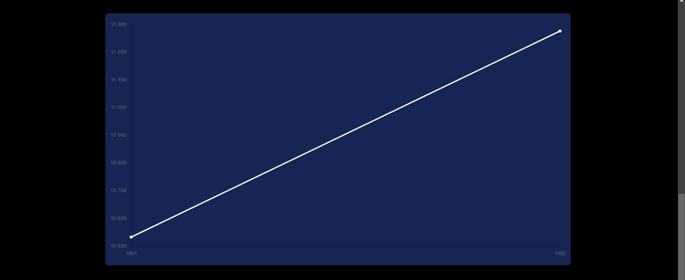

# Carros

## ⚙️ Tecnologias utilizadas ⚙️
- Aplicação fullstack com Turbo Repo para executar o frontend e o backend simultaneamente
- TypeScript para Frontend e Backend

## 💎 Frontend 💎
- Frontend desenvolvido com Next.JS
- Tabler Icons para ícones do Frontend
- TailwindCSS para estilização
- ChartJs para construção dos gráficos no Frontend

## 🧑‍💻 Backend 🧑‍💻
- Backend desenvolvido com Express para criação de rotas

## Ferramentas necessárias e recomendadas para executar o projeto
- Node v20.17.0
- NPM v10.8.3
- Yarn v1.22.22

## 🧐 Como executar esse projeto? 🧐
Faça o clone da aplicação com:
```
  git clone git@github.com:AlexandreConte/carsApp
```

Abra o terminal na pasta carsApp e instale as dependências das aplicações:
```
  yarn
```

Agora basta executar o comando para iniciar a aplicação:
```
  yarn dev
```

Acesse em seu navegador o endereço
<a href="http://localhost:3000/">
  http://localhost:3000/
</a>

## Telas da aplicação

### Tela inicial



Clicando em uma das opções de carro ocorre o acesso para a próxima página:




Clicando em um modelo, acessa os dados do modelo:



